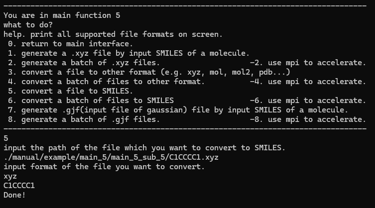
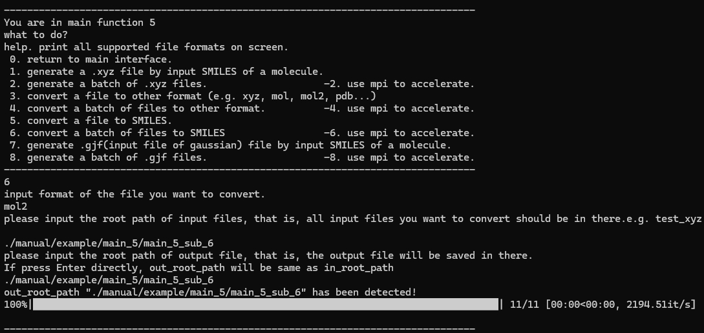
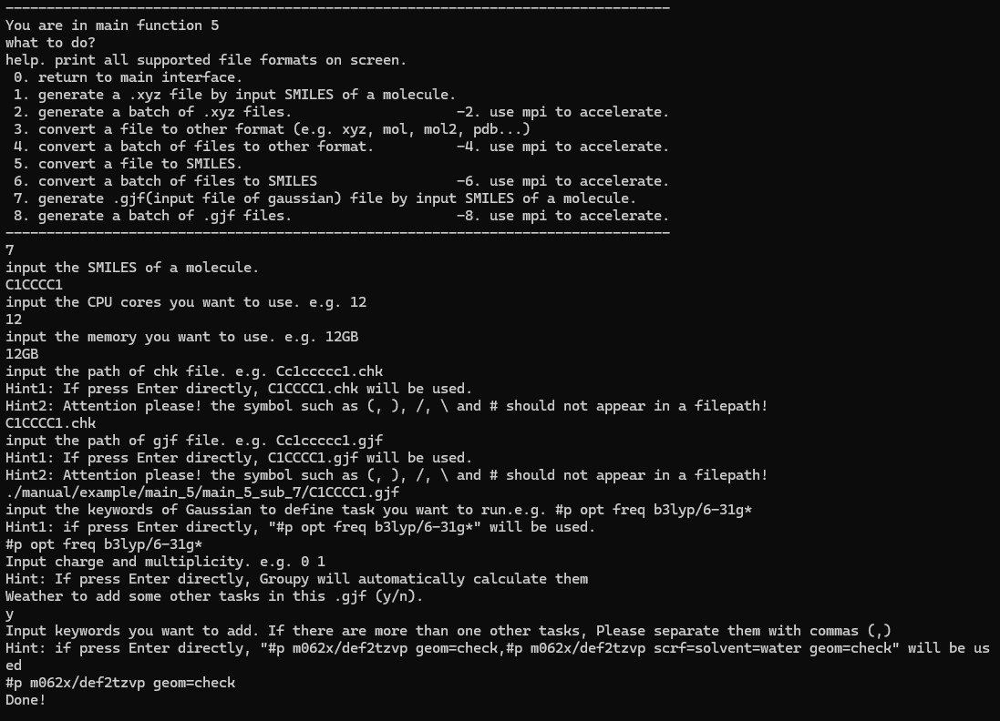

# Groupy 3.0 Manual

[toc]

## 1 Overview

Groupy is a program for calculating various molecular properties and preparing input files of molecular simulation software such as Gaussian. This program requires only SMILES as input, but can output many new useful data and files in multiple formats. The output information is clear and easy to read. The tips to the users are very detailed and easy to follow when using. Message passing interface (MPI) parallelization is supported to reduce computing time when the properties of a large number of molecules are calculated. Groupy not only supports the calculation of molecular properties using the traditional group contribution method, but also directly outputs the group-contribution-style molecular fingerprints for machine learning. The code has strong extensibility, which can be used as an external library to build other programs. We hope that Groupy brings great convenience to both computational and experimental chemists in their daily research. The code of Groupy can be freely obtained at https://github.com/47-5/Groupy


### 1.1 Background

This section introduces the physical and chemical background and computer background for the development of this program.


#### 1.1.1 Group contribution method

Since Macleod introduced the group contribution method for calculating the  molar volume of liquids in 1923, the group contribution method has  undergone rapid development over the past six decades. This method is a  highly accurate approach for estimating the physicochemical properties  of compounds. It offers advantages such as simplicity in prediction  processes, wide applicability, and good generality. Since its proposal  in the mid-20th century, this method has been widely utilized for  estimating the physical properties of pure substances. It is also  employed in equilibrium calculations between different phases,  particularly in estimating equilibria between gas and liquid phases. The group contribution method is a means for predicting phase  equilibrium, enabling not only the estimation and prediction of the  physical and thermodynamic properties of pure substances but also the  prediction of the thermodynamic properties of mixtures. Presently, the  group contribution method can be used to predict various physical  properties of pure substances (such as critical parameters, molar  volumes, refractive indices, thermal conductivities, viscosities, molar  volumes) as well as various thermodynamic properties of pure substances  (including heat capacities, heat of vaporization, saturated vapor  pressures, standard enthalpies of formation), and even the thermodynamic properties of mixtures (such as activity coefficients).

The fundamental assumption of the group contribution method is that  the physical properties of a pure compound or mixture are equivalent to  the sum of the contributions of various groups that constitute the  compound or mixture. In other words, it assumes that the contribution of the same group to physical properties is consistent across different  systems. The key advantage of the group contribution method lies in its  high level of generality. While the number of molecules in the material  world is vast and challenging to count, the number of common organic  groups that constitute organic compounds is relatively small, typically  in the hundreds. Therefore, by leveraging existing experimental values  to estimate the contributions of different groups to various physical  properties, it is possible to predict the properties of other organic  compounds.

The Groupy implements the third-order group  contribution method proposed in "Group-contribution based estimation of  pure component properties," incorporating additional groups and  parameters introduced in "Group-contribution+ (GC+) based estimation of  properties of pure components: Improved property estimation and  uncertainty analysis."

#### 1.1.2 SMILES

SMILES (Simplified Molecular Input Line Entry System) is a line notation (a typographical method using printable characters) for entering and representing molecules and reactions, which was designed by Daylight. SMILES can succinctly represent the topology of a given molecule, while the hydrogen atoms in the molecule are omitted. SMILES, as a system that can fully describe molecular topology, is widely used in the establishment of databases and the training of generative deep learning models.

Below are some rules for SMILES notation:

1. Atoms are represented by their atomic symbols: C for carbon, O for oxygen, N for nitrogen, etc.
2. Hydrogen atoms are often omitted, and implicit hydrogen atoms are assumed based on the valency of the atom.
3. Single bonds are assumed between atoms unless specified otherwise.
4. Rings are indicated by adding a number after an atom to show closure in a cyclic structure.
5. Branches are enclosed in parentheses.
6. Aromatic rings are represented by lowercase letters (e.g., c for benzene).
7. Double and triple bonds are specified by using '=' and '#' symbols, respectively.
8. Chirality can be denoted using '@' symbols.
9. Isotopes can be indicated by adding a mass number before the atomic symbol (e.g., [13C] for carbon-13).
10. Aromaticity in a ring can be represented using lowercase letters or by explicitly using the aromatic bond symbol ':'.

These rules provide a basic framework for encoding molecular structures using SMILES notation.


### 1.2 Dependency

Groupy relies on the following python packages：

+ python >= 3.6
+ tqdm
+ numpy
+ pandas
+ ase
+ rdkit 
+ openbabel
+ joblib

The older or newer versions of the aforementioned dependent packages are unlikely to pose significant issues; however, further extensive testing has not been conducted. Testing has been performed on Windows 11,  Ubuntu 18.04, and CentOS 7.8, where no anomalies were detected.

### 1.3 Architecture of Groupy code

Groupy consists of 6 modules, namely Loader, Counter, Calculator, Convertor, Viewer and Generator. The architecture is illustrated in Figure 1, which overviews the modules in Groupy. Loader is responsible for loading internal data of Groupy, i.e. model parameters and other hyperparameters of the group contribution method. Counter is responsible for counting the number of different types of groups in a given molecule, and can also output a group-contribution style molecular fingerprint that can be used for machine learning. Calculator receives the results of Loader and Counter to calculate different properties of the molecule. Convertor implements the conversion of SMILES to common structural files, such as gro, xyz, POSCAR, as well as the conversion of one format to another among the common chemical files. Viewer provides an interface with ASE to visualize three-dimensional molecular structures. Generator can generate input files of commonly used computational chemistry software according to the molecular structure, such as single point energy calculation,  geometric optimization, and frequency analysis of Gaussian. The computational chemistry software supported by Generator will be constantly updated.


<div align = "center">Figure1. Architecture and the modular map of Groupy code. The arrows indicate the direction of the data, the rounded gray boxes represent the module, and the white boxes represent the input or output data.</div>

### 1.4 Install

Download the source code:

`git clone https://github.com/47-5/Groupy.git`

One may create an environment using Anaconda:

`conda create -n groupy_env python=3.10`

`conda activate groupy_env`

Install:

`pip install .\Groupy\dist\groupy-3.0.0.tar.gz`

`conda install -c conda-forge openbabel`(**Do not** use `pip install openbabel` )

Then one can enter `Groupy` in terminal to start the program.

## 2 Quick start

This section describes how to use the program to calculate the physical and chemical properties of a molecule and to count the number of groups of a given molecule, as well as some other main functions.

### 2.1 Input and input file

Groupy supports two main modes of operation, one computes a single molecule and the other one computes all molecules recorded in a given file in batches.

#### 2.1.1 Single molecule

When computing properties of an individual molecule, one can directly  provide its SMILES string. For instance, the SMILES of cyclohexane is `C1CCCCC1`.

#### 2.1.2 Molecule file

A file recording  the SMILES strings of some molecules should be provided when one wants to calculate properties of a batch of molecules.

Its format can be written as follows:

##### 2.1.2.1 txt

```
CCCCCCCC
CCCC(C)C
CCC(C)(C)C
C=CCCCC
C/C=C/CCC
C=C(C)CC
CC=C(C)C
CC(C)=C(C)C
C=C=CC
C=C=C(C)C
```

There should be only one molecule's SMILES per line (no space), and no blank line.

##### 2.1.2.2 csv

```shell
index,smiles,molar_mass,
0,CC,30.069999999999993,
1,C1CC1,42.08100000000002,
2,CCC,44.09700000000002, 
3,C1CCC1,56.10800000000002, 
```

The format is free, as long as there is a column named `smiles`, the rest of the data will be ignored, but there should be no blank line.

##### 2.1.2.3 xlsx

| index | smiles | molar_mass |
| ----- | ------ | ---------- |
| 0     | CC     | 30.07      |
| 1     | C1CC1  | 42.081     |
| 2     | CCC    | 44.097     |
| 3     | C1CCC1 | 56.108     |
| 4     | CC1CC1 | 56.108     |

The format is free, as long as there is a column named `smiles`, the rest of the data will be ignored, but there should be no blank line.

### 2.2 Run Groupy

When utilizing this program, users can employ Groupy as a standalone  application. Additionally, to retain the maximum extensibility of Python itself, users can import this program as an external library into Python scripts those they create by themselves.

The two distinct ways of utilizing Groupy are outlined below.

#### 2.2.1 Groupy as a standalone program

**Note: The system we used for writing this manual is Windows 11, and the terminal is Anaconda Powershell Prompt provided by Anaconda, which supports some common commands in Linux and supports both Linux and Windows path formats. Please distinguish the file path formats of different systems when using it! **

After the installation is complete according to the instructions in Section 1.4, enter `Groupy` in the terminal to start Groupy. The user will see the main interface as shown in Figure 2.1.


<div align = "center">Figure 2.1 Main interface of Groupy.</div>

The program first displays a basic information, including the program name, developer, and developer contact information (users can contact the developer if they encounter any problems during use, and the developer will provide as much help as possible within their capabilities). Then, the user's location (main interface) is displayed, and the program asks the user what operation to perform. The user only needs to enter the corresponding serial number to command the program to perform the corresponding task.

##### 2.2.1.1 Exit (q)

To exit the program gracefully, just enter `q` in the main interface and press `Enter` on the keyboard, as shown in Figure 2.2.


<div align = "center">Figure 2.2 Exit of Groupy.</div>

##### 2.2.1.2 Visualizing molecules (0)

###### 2.2.1.2.1 Visualizing a molecule based on its SMILES

After starting Groupy, enter `0`-`1`-`SMILES you want to Visualizing` in sequence.


<div align = "center">Figure 2.3 Visualizing a molecule based on its SMILES.</div>

Then, a window showing the 3D structure of the molecule will pop up, as shown in Figure 2.4.


<div align = "center">Figure 2.4 3D structure of a molecule.</div>

###### 2.2.1.2.2 Visualizing molecules based on a file

After starting Groupy, enter `0`-`2`-`file path you want to Visualizing`-`file format you used` in sequence, as shown in Figure 2.5.


<div align = "center">Figure 2.5 Visualizing a molecule based on a file.</div>

##### 2.2.1.3 Calculating properties of a molecule (1)

To calculate the physical and chemical properties of a single molecule, simply enter `1` in the main interface, then press `Enter` on the keyboard, and enter the required instructions according to the subsequent prompts, as shown in Figure 2.6.


<div align = "center">Figure 2.6. Main function 1 of Groupy.</div>

##### 2.2.1.4 Counting group numbers of a molecule (2)

To count the number of groups in a single molecule, simply enter `2` in the main interface, then press `Enter` on the keyboard, and enter the required instructions according to the subsequent prompts, as shown in Figure 2.7.


<div align = "center">Figure 2.7. Main function 2 of Groupy, output results using the clear mode.</div>

Groupy will ask the user whether to use clear mode. The clear mode means that only the results of groups whose number is not zero will be output, while those groups whose number is zero will not be output. When the user wants to output the statistical results in clear mode, type `y` and press `Enter`, the program will start to count and then output the statistical results to the screen. After the statistics are completed, the program will ask the user whether to export the results as a `.csv` file. If the user does want to export, type `y` and press `Enter`, and a file named `{SMILES of the currently calculated molecule}_count.csv` will be generated in the main directory of the program. If the user does not need to output the results as a file, type `n` and press `Enter`.

If the user wishes to output all statistical results, the clean mode should not be used (this is common when one wishes to obtain a group contribution style molecular fingerprint). Then, the user's input and the program's output are shown in Figure 2.8.


<div align = "center">Figure 2.8. Main function 2 of Groupy.</div>

##### 2.2.1.5 Calculating properties of a batch of molecules (3)

If the user needs to calculate the physical and chemical properties of a batch of molecules, he/she needs to first prepare a molecular file introduced in Section 2.1.2, enter `3` in the main interface, and then press `Enter` on the keyboard, and enter the required instructions according to the subsequent prompts, as shown in Figure 2.9.


<div align = "center">Figure 2.9. Main function 3 of Groupy.</div>

When you enter main function 3 by typing `3` in the main interface, the program will prompt the user to enter the file path where the SMILES strings of the molecules are saved. After the user enters the file path and hits `Enter`, the program will automatically read the SMILES recorded in the molecule file and then perform the calculation. When the calculation is completed, the results will be written to `batch_results.csv` in the current working directory.

##### 2.2.1.6 Calculating properties of a batch of molecules with MPI acceleration (-3)

In modern computers, the Central Processing Unit (CPU) typically  consists of multiple cores. To fully leverage the multi-core  capabilities of the CPU when computing properties for a batch of  molecules, one can utilize Message Passing Interface (MPI) for parallel  computing.

Similar to Section 2.2.1.5, one needs to prepare a file as introduced in Section 2.1.2. In the main interface, input `-3`, then press `Enter` on the keyboard. Then, the user follows subsequent prompts to input the desired command, as illustrated in Figure 2.10.


<div align = "center">Figure 2.10. Main function -3 of Groupy.</div>

##### 2.2.1.7 Counting number of different groups of a batch of molecules (4)

There is almost no difference between the usage of main function 4 introduced in this section and main function 3 introduced in 2.2.1.5, as shown in Figure 2.11.


<div align = "center">Figure 2.11. Main function 4 of Groupy.</div>

##### 2.2.1.8 Counting number of different groups of a batch of molecules with MPI acceleration (-4)

There is almost no difference between the usage of main function -4 introduced in this section and main function -3 introduced in 2.2.1.6, as shown in Figure 2.12


<div align = "center">Figure 2.12. Main function -4 of Groupy</div>

##### 2.2.1.9 File-related operations (5)

Although the group contribution method is versatile and computationally  efficient, its accuracy is limited. Therefore, in addition to the group  contribution method itself, this program also provides users with  functionality for visualization and generating files required for  molecular dynamics and quantum chemical calculations. This feature is  particularly useful when initially screening with the group contribution method and subsequently refining with higher-precision methods.

###### 2.2.1.9.1 Converting SMILES to xyz file (5_1)

The xyz file (http://sobereva.com/477) is almost the simplest file format for recording three-dimensional structure of a molecule. Almost all visualization programs can open it (such as Gaussview, VESTA, VMD, etc.).

If the users want to obtain the xyz file of a molecule by entering its SMILES string, they only need to enter `5` in the main interface, then type `Enter` on the keyboard, and further enter `1` and type `Enter`. Then, enter the required instructions according to the subsequent prompts, as shown in Figure 2.13.


<div align = "center">Figure 2.13 Sub-function 1 of main function 5</div>

###### 2.2.1.9.2 Converting a batch of SMILES to xyz files (5_2)

If the user needs to generate a batch of xyz files for molecules, he/she needs to first prepare a molecular file introduced in Section 2.1.2, enter `5` in the main interface, press `Enter` on the keyboard, then enter `2` and press `Enter`, and enter the required instructions according to the subsequent prompts, as shown in Figure 2.14.


<div align = "center">Figure 2.14 Sub-function 2 of main function 5.</div>

###### 2.2.1.9.3 Converting a batch of SMILES to xyz files with MPI acceleration (5_-2)

There is almost no difference between the usage of sub function -2 of main function 5 introduced in this section and main function -3 introduced in 2.2.1.6.

###### 2.2.1.9.4 Converting file format (5_3)

This program also provides the function of converting file formats. Users only need to provide the original file format and its path to be converted, and then specify the required file format and path, as shown in Figure 2.15. **This function of this program is based on openbabel, so this function supports all file formats supported by openbabel, such as: xyz, mol, mol2, pdb...**


<div align = "center">Figure 2.15 Sub-function 3 of main function 5.</div>

###### 2.2.1.9.5 Converting format of a batch of files (5_4)

When one needs to convert the file formats of a batch of files, he/she should first put the files to be converted into the same folder. Then, enter the sub-function `4` of the main function `5`. First, the program will ask the user what the file format is to be converted, and then one needs to enter the root directory of the file to be converted (that is, the directory where all the files you want to convert are saved). Then, the program asks the user what format he/she wants to convert the file to. After the user enters the command (such as xyz, mol, mol2, pdb, gro, etc.), the program requires the user to specify the root directory of the new file after conversion (that is, all newly generated files will be saved there). Figure 2.16 shows the specific operations.


<div align = "center">Figure 2.16 Sub-function 4 of main function 5.</div>

###### 2.2.1.9.6 Converting format of a batch of files with MPI acceleration (5_-4)

There is almost no difference between the usage of sub function -4 of main function 5 introduced in this section and main function -3 introduced in 2.2.1.6.

###### 2.2.1.9.7 Converting a file to SMILES (5_5)

One can convert a file (xyz, mol2, ...) to a SMILES string, as shown in Figure 2.17. The result will be printed on the screen.



<div align = "center">Figure 2.17 Sub-function 5 of main function 5.</div>

###### 2.2.1.9.8 Converting a batch of files to SMILES (5_6)

When users want to convert a batch of files to SMILES, they can use sub-function 6 of main function 5, as shown in Figure 2.18.



<div align = "center">Figure 2.18 Sub-function 6 of main function 5.</div>

###### 2.2.1.9.9 Converting a file to SMILES with MPI acceleration (5_-6)

There is almost no difference between the usage of sub function -6 of main function 5 introduced in this section and main function -3 introduced in 2.2.1.6.

###### 2.2.1.9.10 Generating .gjf (input file of Gaussian) file by input SMILES of a molecule (5_7)

The program also offers users the capability to generate Gaussian input  files (gjf files) based on the SMILES of molecules. Users simply need to access the sub-function 7 of the main function 5 and follow the prompts accordingly, as depicted in Figure 2.19.



<div align = "center">Figure 2.19 Sub-function 7 of main function 5.</div>

###### 2.2.1.9.11 Generating a batch of .gjf files (5_8)

The gjf file of molecules can also be generated in batches. Groupy asks the user to enter the path of the file that records the SMILES of a batch of molecules, and the program will automatically read the SMILES recorded in it. The program then asks the user to enter the root directory to save generated gjf file (that is, all the generated gjf files in this task will be saved there). Figure 2.20 shows detailed operations.


<div align = "center">Figure 2.20 Sub-function 8 of main function 5.</div>


###### 2.2.1.8.12 Generating a batch of .gjf files with MPI acceleration (5_-8)

There is almost no difference between the usage of sub function -8 of main function 5 introduced in this section and main function -3 introduced in 2.2.1.6.

#### 2.2.2 Groupy as an external Python library

The program can also be imported as an external library into user-written python scripts. We only give an example here, for more details, please refer to the API documentation in Groupy/doc

##### Calculating properties of a molecule

```python
from groupy.gp_calculator import Calculator  


c = Calculator() 
result = c.calculate_a_mol('C1CCCC1')
print(result)
```


### 	


